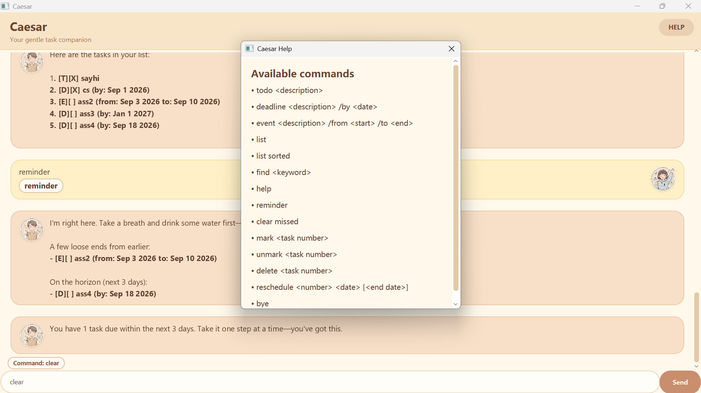

# Caesar User Guide

Caesar is a personal task assistant for recording tasks, tracking deadlines, and managing events. You can use Caesar through the graphical user interface (GUI) or by entering commands.



## Getting started

### Prerequisites

- Install **Java 25** or a later version.
- Clone or download the project repository.

### Run Caesar

From the project directory, run:

```powershell
.\gradlew.bat run
```

### Run the packaged JAR

If you downloaded `Caesar.jar` from a release, you can run Caesar without
opening the project in an IDE or installing Gradle. Make sure Java 25 is
installed, open a terminal in the folder containing the JAR, and run:

```text
java -jar Caesar.jar
```

Caesar stores tasks in `data/tasks.txt` relative to the folder where it is
started. Run the JAR from a folder where you have permission to create and
update this `data` folder.

When the GUI opens, Caesar first displays a greeting. It then shows a reminder dialog when there are dated tasks that are overdue or due within the next three days. The reminder dialog contains two sections:

1. **Missed tasks**: pending deadlines or events whose relevant date has passed.
2. **Tasks due soon**: pending deadlines or events due today or within the next three days.

The reminder also includes a separate dynamic comment dialog. Completed tasks and undated to-do tasks are not included in reminders.

## Command format

Enter one command at a time in the command box. Task numbers are one-based: the first task in the list is task `1`.

| Command | What it does |
| --- | --- |
| `todo <description>` | Adds an undated to-do task. |
| `deadline <description> /by <date>` | Adds a task with a deadline. |
| `event <description> /from <start> /to <end>` | Adds an event with a start and end date. |
| `list` | Shows all tasks in their current order. |
| `list sorted` | Shows tasks with pending tasks before completed tasks. |
| `find <keyword>` | Shows tasks whose descriptions contain the keyword. |
| `reminder` | Shows missed tasks and tasks due within the next three days. |
| `clear missed` | Removes all pending dated tasks whose relevant date has passed. |
| `mark <task number>` | Marks a task as completed. |
| `unmark <task number>` | Marks a task as pending again. |
| `delete <task number>` | Deletes a task. |
| `reschedule <number> <date> [<end date>]` | Changes a deadline date or an event's start and end dates. |
| `help` | Shows the available command formats. |
| `bye` | Saves the task list and exits Caesar. |

## Date formats

Deadlines, event start dates, and event end dates accept any of these formats:

- `YYYY-MM-DD`, for example `2026-09-01`
- `DD/MM/YYYY`, for example `01/09/2026`
- `MMM d yyyy`, for example `Sep 1 2026`

## Add tasks

### Add a to-do task

Use `todo` when a task has no date attached to it:

```text
todo Read the software engineering textbook
```

### Add a deadline

Use `/by` followed by a date:

```text
deadline Submit the project report /by 2026-09-01
```

### Add an event

Use `/from` for the start date and `/to` for the end date:

```text
event Project presentation /from 2026-09-01 /to 2026-09-02
```

## View and search tasks

Show every task:

```text
list
```

Show pending tasks first:

```text
list sorted
```

Search by a word or phrase in the task description:

```text
find project
```

## Use reminders

Run the reminder command at any time:

```text
reminder
```

Caesar separates reminders into missed tasks and tasks that can still be completed in time. A deadline is classified using its `by` date, while an event is classified using its end date. Tasks due after the three-day window do not appear in the reminder.

To remove all pending dated tasks that are already overdue, use:

```text
clear missed
```

Use this command carefully because the missed tasks it removes cannot be restored through Caesar.

## Update task status and dates

Mark task `2` as completed:

```text
mark 2
```

Reopen task `2`:

```text
unmark 2
```

Delete task `2`:

```text
delete 2
```

Reschedule a deadline:

```text
reschedule 2 2026-09-15
```

Reschedule an event's start and end dates:

```text
reschedule 3 2026-09-15 2026-09-16
```

## Need help?

Enter `help` in Caesar or click the **HELP** button in the GUI to view the supported command formats.

For Markdown conventions used in this guide, see [GitHub's basic writing and formatting syntax](https://docs.github.com/en/get-started/writing-on-github/getting-started-with-writing-and-formatting-on-github/basic-writing-and-formatting-syntax).
